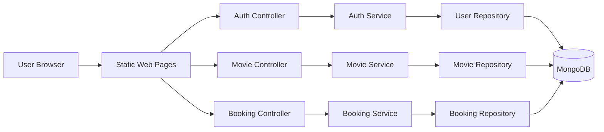
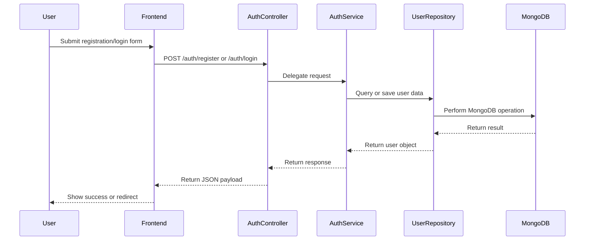
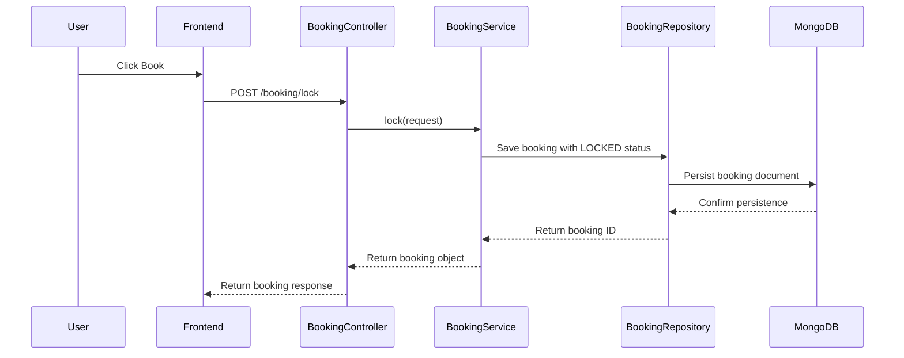

# CinemaSync Formal Architecture Document

## 1. Purpose

This document describes the architectural design of CinemaSync as a lightweight movie-booking web application. It captures the system context, runtime architecture, component responsibilities, data model, quality attributes, and the main technical risks and evolution paths.

---

## 2. System Scope

CinemaSync supports the following user-facing capabilities:

> Security posture update (2026-07-29): the architecture remains a simple monolith, but the security review has identified the need for authentication enforcement, authorization checks, password hashing, secure session handling, and HTTPS hardening before the system is suitable for broader public use.

- User registration
- User authentication
- Movie discovery and listing
- Seat locking for a booking
- Booking confirmation
- Basic payment-related endpoints

The current implementation is a minimum viable product (MVP) designed for rapid prototyping and educational use.

---

## 3. Architectural Goals

The design prioritizes:

- Simplicity of implementation
- Clear separation of concerns
- Fast development iteration
- Low operational overhead
- Compatibility with a document database

---

## 4. Architectural Style

The system follows a layered, request-driven architecture:

- Presentation layer: HTML and JavaScript served as static web assets
- Application layer: Spring MVC controllers and service classes
- Persistence layer: Spring Data MongoDB repositories
- Data store: MongoDB

This structure is appropriate for a small-to-medium web service where maintainability is more important than highly distributed complexity.

---

## 5. High-Level Architecture

---

## 6. Component Responsibilities

### 6.1 Presentation Layer

Responsibilities:
- Serve login, register, movies, and landing pages
- Collect user input from forms
- Invoke REST APIs through the Fetch API

### 6.2 Controller Layer

Responsibilities:
- Receive HTTP requests
- Parse request payloads
- Delegate to the service layer
- Return response objects as JSON

Controllers in the system:
- AuthController
- MovieController
- BookingController
- PaymentController

### 6.3 Service Layer

Responsibilities:
- Encapsulate business logic
- Coordinate repository access
- Apply domain rules such as booking state transitions

Services in the system:
- AuthService
- MovieService
- BookingService
- PaymentService

### 6.4 Repository Layer

Responsibilities:
- Abstract data access to MongoDB
- Expose CRUD-style operations
- Support domain object persistence and lookup

---

## 7. Domain Model

### User
Represents a registered user.

Key attributes:
- id
- name
- email
- password

### Movie
Represents a movie available for browsing and booking.

Key attributes:
- id
- title
- imdbRating
- genre

### Booking
Represents a reservation attempt or booking transaction.

Key attributes:
- id
- userId
- movieId
- seats
- status
- lockTime

---

## 8. Request Flow Overview

### Authentication Flow

### Booking Flow

---

## 9. Deployment Considerations

The current deployment model is simple:

- Single Spring Boot application instance
- Local MongoDB database
- Browser-based client

This model is suitable for development and demos, but production deployment would typically require:

- A managed database service
- A reverse proxy or load balancer
- Environment-based configuration
- Containerization and observability

---

## 10. Quality Attributes

### Maintainability
The layered design makes components easier to reason about and change.

### Extensibility
New features such as payments, seat inventory, and admin roles can be added with minimal disruption.

### Simplicity
The architecture avoids unnecessary complexity for an MVP.

### Scalability
Current implementation is adequate for low traffic but would need optimization for larger scale.

---

## 11. Current Limitations

The architecture is intentionally simple, but several limitations remain:

- No authentication token mechanism yet
- No robust seat conflict handling
- No lock expiration policy
- No real payment gateway integration
- No pagination for large movie collections
- No formal automated test strategy in the visible workspace snapshot

---

## 12. Recommended Evolution Path

### Near-Term
- Introduce JWT-based authentication
- Add input validation and proper error handling
- Add tests for controllers and services

### Medium-Term
- Introduce seat inventory and screening models
- Add booking expiration and conflict detection
- Add pagination and sorted query support in MongoDB

### Long-Term
- Add real payment integration and observability
- Deploy with Docker and a managed cloud database
- Add role-based administration and audit trails
