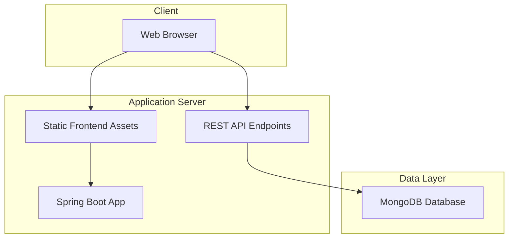
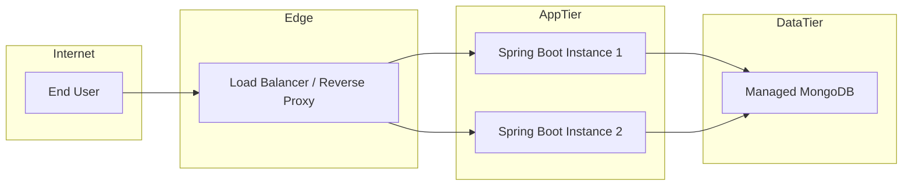

# CinemaSync Deployment Diagram

## 1. Current Deployment Model

The current deployment topology is a simple single-node web application deployment:

> Deployment hardening note (2026-07-29): the current model is suitable for local development, but the recommended production target adds HTTPS, reverse proxy protection, managed secrets, and authenticated application access.

- A Spring Boot application serves both the API and the static frontend pages
- A MongoDB instance stores users, movies, and bookings
- The browser accesses the app over HTTP on localhost

This arrangement is suitable for development and demo environments.

---

## 2. Logical Deployment View

---

## 3. Runtime Components

### Client
- Browser running the HTML/JavaScript UI
- Uses Fetch API to call backend endpoints

### Application Server
- Hosts the Spring Boot application
- Exposes HTTP endpoints on port 8080
- Serves static HTML and JavaScript assets

### Database Server
- MongoDB instance on localhost:27017
- Stores application data in the cinemaSync database

---

## 4. Deployment Notes

### Development Deployment
- App runs locally using Maven or the Spring Boot wrapper
- Database runs locally or is reachable over MongoDB URI

### Recommended Production Deployment
A more production-ready deployment would typically include:

- A reverse proxy such as Nginx or an ingress controller
- A managed MongoDB service such as MongoDB Atlas
- Separate application and database tiers
- Environment-based configuration for secrets and connection strings
- Container orchestration using Docker/Kubernetes or a platform like Render/Railway

---

## 5. Proposed Production Topology

---

## 6. Deployment Concerns

### Security
- Use HTTPS in production
- Store secrets in environment variables
- Protect admin APIs with authentication and authorization

### Reliability
- Add health checks and monitoring
- Configure automatic restarts and scaling

### Performance
- Add connection pooling and indexing where appropriate
- Use pagination for list endpoints

### Observability
- Add logs, metrics, and tracing
- Monitor database latency and request error rates

---

## 7. Summary

CinemaSync currently uses a simple monolithic deployment model with one application server and one MongoDB database. This is well suited for development and MVP scenarios. For production, the system should evolve toward a more resilient and scalable architecture with a managed database, load balancing, and stronger operational controls.
