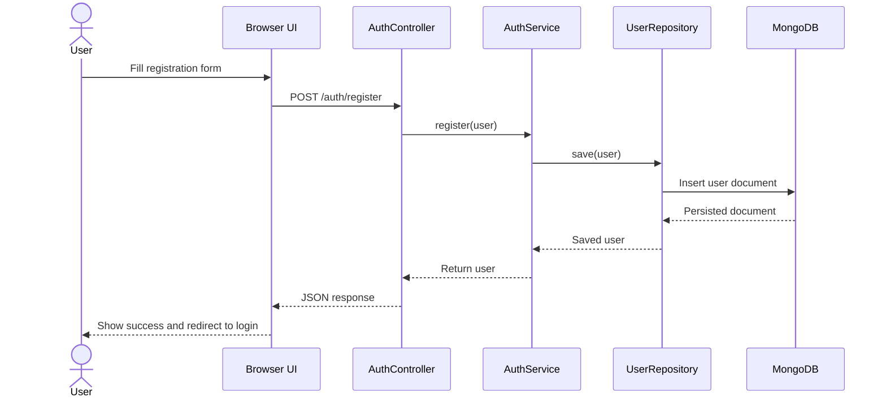
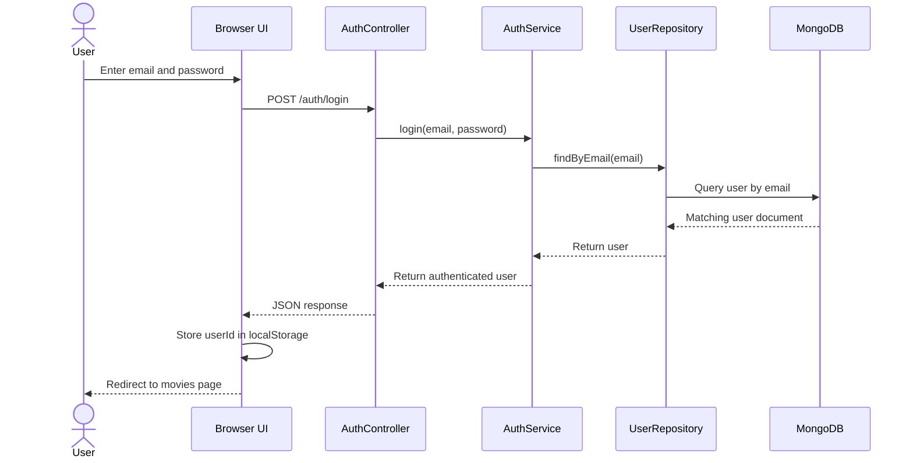
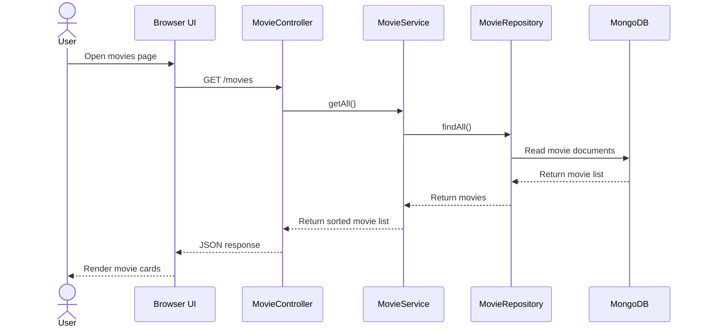
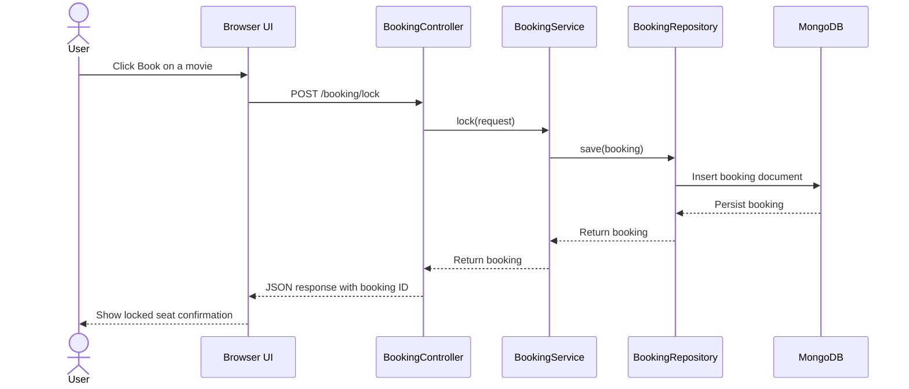
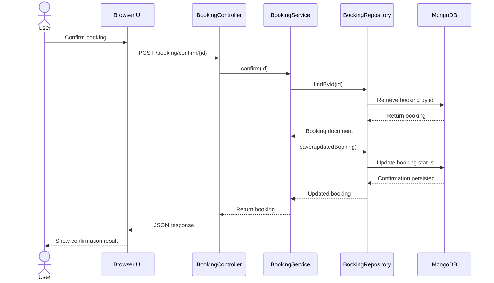

# CinemaSync Sequence Diagrams

> Security context (2026-07-29): the diagrams below document the current functional flow and the intended future hardening boundary where protected actions require authenticated sessions and server-side authorization.

## 1. User Registration Flow

## 2. User Login Flow

## 3. Movie Listing Flow

## 4. Seat Locking Flow

## 5. Booking Confirmation Flow

